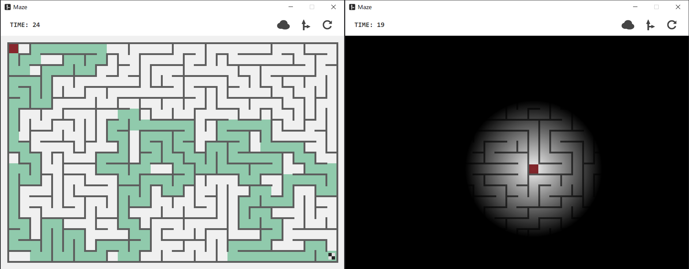

# Maze

**C++ 课程设计项目，基于 Qt 制作的一个迷宫小游戏**

## 项目简介

本项目为一个基于 Qt 制作的迷宫小游戏，具有如下特点。

- 基于深度优先搜索的迷宫生成算法：初始时迷宫中没有任何的通路，随机选取一个初始点，从该点出发按照深度优先搜索的策略，随机选取移动方向，遍历迷宫中的所有单元，同时打通前进方向上的围墙。当所有的单元都被访问后，迷宫也同时生成完毕，算法保证迷宫中的每个单元之间都是可达的。

- 基于广度优先搜索的迷宫寻路算法：从当前玩家所在的位置出发，按照广度优先的策略遍历迷宫中所有单元，直到访问到终点。同时记录每个被访问单元的前驱单元，回溯形成最短路径。

- 在迷宫中移动操控优化：算法会自动识别玩家的转向操作，并根据玩家当前所处的位置进行处理，从而使得玩家不必完全抵达需要转向的单元也可正常发出转向指令，提高玩家操作的容错性。

- 迷雾模式：在此模式下，玩家的视野受限，仅能看到自身一定范围内的迷宫情况，游戏更具挑战性。

## 效果展示

